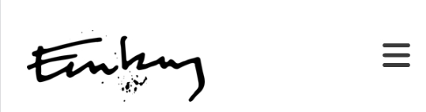

# My Art portfolio Page
This art portfolio website is a shop window for my art and a place where I can market myself as an artist.
Users of this website will be able to view a selection of my art and upcoming events. It also serves as a point of contact springboard the users to the London based online gallery, artfinder.com where my art can be purchased as well as links to further social media.

[View the live project here.](https://gustafenebog.github.io/CODE-project-1/index.html)

## Features

### Favicon

  + favicon

### The header with the navigation bar

  + The header features the artist Enebog-logo to the left and the four navigation links: Home, Works, About, Contact (for larger devices) or the “hamburger” icon (for smaller devices) to the right.
  + This is a single page scrolling website (with the exception of the individual art-piece-display pages the user is taken to when clicking on an art piece on the main page) that takes the user to the correct section, within the page, when a link is clicked.
  + The header with its nav elements is always fixed  (except on the individual art-piece-display pages) and creates therefore a quick and easy to understand navigation experience.
  + The Enebog-logo also doubles as an extra home button.
  + On larger devices the navigation is lined up in a row on the right side of the header.
  + The navigation links for large screen devices are being underlined when hoovered over.
  + A click anywhere on an individual art page takes the user back to the last place he was at on the main page.  

+ The top of the page “introductory”-“attention grabbing”-“lateset”image
  + The top of the page features a high-resolution image of an art piece with a text overlay to give the user a wow-effect to grab the users attention
  + MORE HERE

### The Works-section
  + The Works-section displays three galleries with nine art pieces each displayed in a 3x3 grid
  + The images of the art-pieces zooms to a larger size when hovered and can be clicked if the user want to see a larger display of the art piece. The user is then taken to a separate display page (unique for each art piece) where the art is annotated and display in a larger size. Currently the display page of only one art pieces has been implemented which is the first image (braided flask).

### The full-size display-page
  + A selection of the artist art-pieces organized in a rectangular grid.

### The ABOUT-section
  + This section features a photo of the artist together with a short bio explaining his process, favorite motives and mediums and his reasons for drawing and painting.

### The Contact-section with form
  + The contact section provides postal address, email and telephone number to the artist as well as non-interactive map showing where in Europe the artist is based. All fields (except subject) are reqiered to be filled in and filled in correctly before the message is allowed to be submitted.
  + The contact section also provide a form which the user can use as a way of reaching out to the artist directly.
  + A call-to-action button linking to a “Get in touch forms/contact ”SCREEN SHOOT OF FOOTER

### The Footer
+ xxxxxxx
  + The footer contain icons linking to all the places the artist can be found in social media (not yet implemented) including a link to the London based online gallery, Artfinder, where Enebog’s art can be acquired. 

+ Features remaining to be implemented
  + Make carousel/slide show of top of the page image 
  + Responsive design on the art display page to make the image (with annotation) fill the screen without overflowing 

## Design
+ One page website (ideally unless modal screen is not implemented) with header with logo and navbar always visible.
Since the users can be expected very often to not be very IT savvy (older and culturally oriented rather than technically oriented ) the website needs to be very simple (single page site) and intuitive and should remain so even if more content is being added. The solution for this is a single page website and with the logo and navbar always visible as well as a clean, simplistic uncluttered design

As this is an artist website showing of Art, the Surface Plane with its graphics is arguably more important than the sites functional features (providing they all work, that is) since this is to work in concert with and enhance the content/art.
### Design
The minimalistic, uncluttered, and sober graphics of the site are not only modern and user friendly for less it-savvy artist lovers but it does also provide the perfect setting for displaying art much like the simple white walls in a real art gallery.
### Colors
The Black and White color theme provides a color-neutral background that does not interfere with the color theme of the actual art. It also has the secondary benefit of not distracting or drawing attention to itself but rather to put all of the attention and focus on the art. 
One accent color, orange, has been used (away from the vicinity of the gallery section) on a “call to action”-button, again, the effect of the accent color becomes more efficient with the otherwise neutral color scheme.
Art is classically displayed on an either white or black background. We use a white background for the overview grid with large thumbnails and a black background when an image has been clicked and being displayed full size. The black background on the last two sections (“About” and “Contact”) sets these two sections apart from the rest of the site and allow the footer to “return” to a white without any dividing line.
Font color on the black background sections (“About” and “Contact”) is set to a light grey rather than white for making user experience easier on the eyes according to article: When to Use White Text on a Dark Background ( https://uxmovement.com/content/when-to-use-white-text-on-a-dark-background/#:~:text=The%20kind%20of%20text%20that,can%20strain%20the%20user's%20eyes. ) A photoshop color picker on a example screen shots was used to determine hex code () 
Used font color to not be white but rather grey according to the following article. Using a color picker to determine what white gitpod was using in its dark mode

[Screenshot of color scheme.](assets/images/enebogart-logo.png)

[Screenshot of fonts used.](assets/images/enebogart-logo.png)

### Typography
Care has been taken to match the font for the headers with that of the paragraphs. A match making tool was used pairing for example x with y however...  fontpair.co
'Open Sans Regular400 font family with Montserrat as a fallback font and sans-serif as the second fallback font

'Open Sans Regular 400', 'Montserrat', sans-serif;
@import url('https://fonts.googleapis.com/css2?family=Montserrat:ital,wght@0,300;0,400;1,300;1,400&family=Open+Sans:ital,wght@0,300;0,400;1,300;1,400&family=Spectral+SC:ital,wght@0,300;1,200&display=swap');

## Technologies Used
+ HTML5
+ CSS3
+ [Google Fonts:](https://fonts.google.com/) To import font family ’XXXXXXXXX’ into the style.css file which is used on all pages.
  
Added fallback font sans-serif.
+ [Font Awesome:](https://fontawesome.com/) used in footer section to social icons and "hamburger"-icon in navbar for devices below a screens width of XXXXXXXXX.

Fontpair.coxxxxxxxxxxxxxxxxxxxxxxxxxxxxxxxxxxxxxxxxxxxxxxxxxxxxxxx

+ [Krita:](https://krita.org/en/) Used for creating, editing and re-sizing images (bitmap art).
+ [Clip Studio Paint:](https://www.clipstudio.net/en/) Used for creating and editing vectorgraphics-art such as the Enebog-logo.
+ 
+ [Tiny PNG:](https://tinypng.com/) Compressing images.
+ 
+ [Am I Responsive:](http://ami.responsivedesign.is) Checking the responsiveness and generating the image in the beginning of this document showing my website on different devices/screensizes.
+ [GitPod](https://www.gitpod.io/) GitPod has been used as a cloud based IDE from which code was commited and pushed to GitHub.
+ [GitHub:](https://github.com/) GitHub is used to store the code that has been pushed from GitPod.

## Testing
### Manual testing
+ I have manually tested that:
	+ the links work and land you on the correct page or correct section within the page
	+ a wrong input, e.g. email address field without an @-sign receive a complaint as well as a form submission-button-click results in a confirmation page
  + the links in the header works correctly.
  + the navigation links work and the user is directed to the correct sections of the page.
  + the navigation links change text colour when hovering over.
  + the external link in the about section opens in a new tab and that the address is correct.
  + name, email and message is required to submit the form in the contact section.
  + the email input field must contain @ symbol to submit the form in the contact section.
  + the form submit button change text colour when hovering over.
  + “zoom on hover” work in gallery-section
+ Manual testing has been carried out on:
  + Different browsers: Chrome and Firefox (Safari as not been tested) where a a bug in the form element was appearing in Firefox 
  + Responsiveness using different standard screen sizes testing the responsive design.

### Validator Testing
+ All code was tested for syntactical errors with perfect results using official validators:
+ HTML using the the 

+ CSS using Jigsaw

+ Lighthouse (Chrome developer tools) to test for performance, accessibility, progressive web apps, SEO, and more.

+ It is a countioous decistion to not improve on the suggestion by lighthouse since this interferes with the principle of readabiltiy

### Bugs
+ Fixed bugs:
  + Change in logo and header height would not come through due to conflicting css-rules
  + Page overflowed horizontaly (slider appeared)
+ Remaining bugs
  + the "underline on hoover" has stopped working at some version of the code.
  + Box shadow under header does not disapear with the responsive design for larger screensizes.

+ YES BUCKET!!!
  + Create link "arrow" back back to index.html from the large, high-resolution image page (braide-flask.html).
  + Fix gallery grid
  + Fix About and contact
  + Adjust start of main content as to not hide under header
  + Right align send button
  + Make message field larger
  + Make first and last name field sideby side
  + Padding before gallery headlines
  + Padding before About section and between about and contact
  + Make background all the way down on gallery display page

+ Delete unused image files(2000px)
+ Clean up code (delete commented out code)
+ Delete unused files
+ Clean up surplus CSS-rules
+ Clean up row structure (delete multiple empty rows etc.)
+ ...and OMG there is more!

+ MAYBE BUCKET!
  + Make logo slightly larger, header slightly higher and push nav elements further down
  + Add slider/carousel for the Hero image
+ NO BUCKET

  Compression of word files
Mix of black and white boxes in form!!!
Glöm inte atts kapa hyperlänkar som Bonsai
Saved jpg with progressive check box checked so that a lower grade resolution image load first before the higher res…
Add screenshots to readme
should I wrap long paragraphs!?
write that the jpg images are saved as progressive
color on cover text  rgba(185, 187, 182, 0.7);
The display page is not responsive
Subject is not required

Remaining bugs
subject and message has black backgrounds.
In Firefox portrait in about section is no longer centered and form have slided down into the footer

### Deployment
+ Go to your GitHub repo and choose the **settings** tab and then **Pages** on the left-hand sidebar and then make sure that the following is set as below:
  + **Sources** is set to ‘Deploy from Branch’
  + **Main** branch is selected.
  + **Folder** is set to / (root)
+ Click save and go back to the **Code** tab and wait a few minutes for the build to finish. Make sure that you do not push to the repo during this time since this will cause the rebuild to fail.
+ Go to the **github-pages** under the **Deployment** section, further down on the right hand side.
+ Now you can see the URL to your deployed site under **Active deployments**. Click on the URL to go to your site. The URL will follow the following format: your-username.github.io/your project name/

### Miscellaneous
+ Commit messages
A review of the commit messages for the first 12 days of programming showed that the soft rule of max 50 characters was broken with 10 characters on average. Furthermore, the hard rule of max 72 characters was (out of the 44 commits) broken in 30% of the commits. The commits after this point was improved both in number of characters and in terms of text.
+ Loading time for images
  + The large images was reduced to the approximate size it was to be displayed at. The Hero image was set to to 2000px based on a largest common desktop screen size width of 1920px. The width of the gallery images displayed on index.html was set to 900px. This was determined based on a three row column with a 150% “zoom on hover”: 1,5*(1920/3)=960. Taking this number minus padding and we would end up with roughly 900 px. 
  + A further adaption of image sizes for smaller screens has not yet been carried out due to time constraints.
The idea was further to reduce loading times by zipping files using “tinyPNG” or similar to create .zip or .rar files however efforts to find out if this was at all possible was abandoned due to time constraint reasons.

## Credits
### Readme
+ Inspiration for this readme-file has been taken from the readme-files of:
  + Code Institute "Coding Club"
  + Code Institues "Love Running"
  + My Bonsai Page by mittnamnkenny

### Code
+ The code for the header with navbar, form and footer from Code Institute's "Love Running" was used as a starting point for my code.
+ Code that is supposed to making the whole page clickable (not just back arrow) is taken from a forum however I am sorry to say that I have not been able to retrieve the source back to give credit
+ "Zoom on Hoover" code snippet from 3W Schools has been used and modified to make images in the galleries in the work-section zoom when they are being hovered. 

### Earlier implementation
+ The Features and Design sections has been based on Jesse James Garretts five pillars of webdesign.
+ Enebog art has already been implemented in a Squarespace-version. This new version has a changed design and it improves on weak points of this first version:
  + The all-important art was not displayed directly upfront but one or two clicks away
  + Even after one click all of the art was not displayed in one single grid but required the user to step through each gallery one picture at a time.
  + The about and contact sections was separated albeit they fitted well together.

### Acknowledgement
A special thanks to my mentor at Code Institute for most helpful input.

