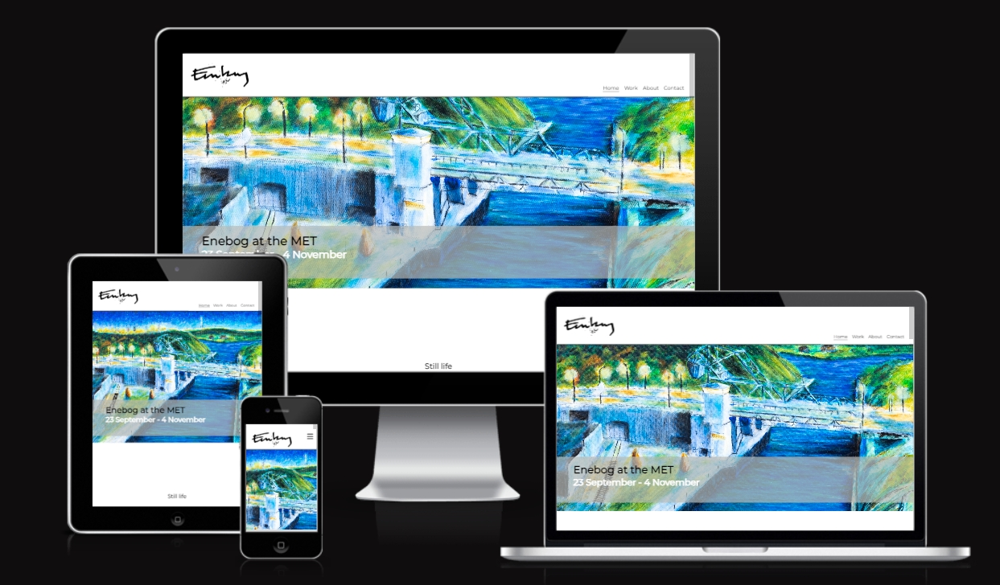

# My Art Portfolio Page
This Art Portfolio website is a shop window for my art and a place where I can market myself as an artist.
Users of this website will be able to view a selection of my art and upcoming events. It also serves as a point of contact springboarding the users to the London based online gallery, [artfinder.com](https://www.artfinder.com/artist/gustaf-enebog/) where my art can be purchased as well as links to further social media.

[View the live project here.](https://gustafenebog.github.io/CODE-project-1/index.html)

## Features

### Favicon
+ The favicon is made up by the E in the Enebog-logo.
+ The favicon has been produced in all relevant file formats.

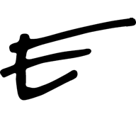

### The header with the navigation bar

  + The header features the artist Enebog-logo to the left and the four navigation links: Home, Works, About, Contact (for larger devices) or the “hamburger” icon (for smaller devices) to the right.
  + This is a single page scrolling website (with the exception of the individual art-piece-display pages the user is taken to when clicking on an art piece on the main page). These takes the user to the correct section, within the page, when a link is clicked.
  + The header with its nav elements is always fixed  (except on the individual art-piece-display pages) and creates therefore a quick and easy to understand navigation experience.
  + The Enebog-logo also doubles as an extra home button.
  + On larger devices the navigation is lined up in a row on the right side of the header.
  + The navigation links for large screen devices are being underlined when hoovered over.
  + A click anywhere on the individual art display page takes the user back top of the main page.  

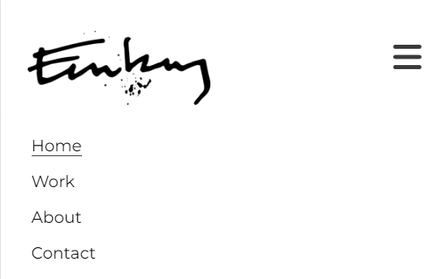
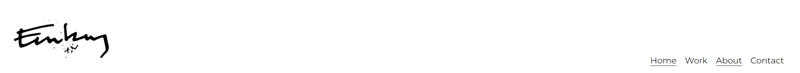

### "Hero”-image
  + The top of the page features a high-resolution image of an art piece with a text overlay to give the user a wow-effect and at the same time highlighting upcoming events.

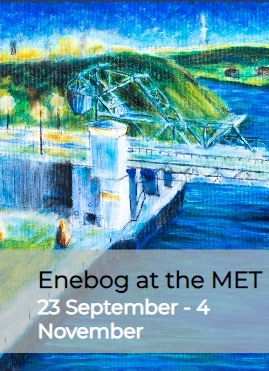
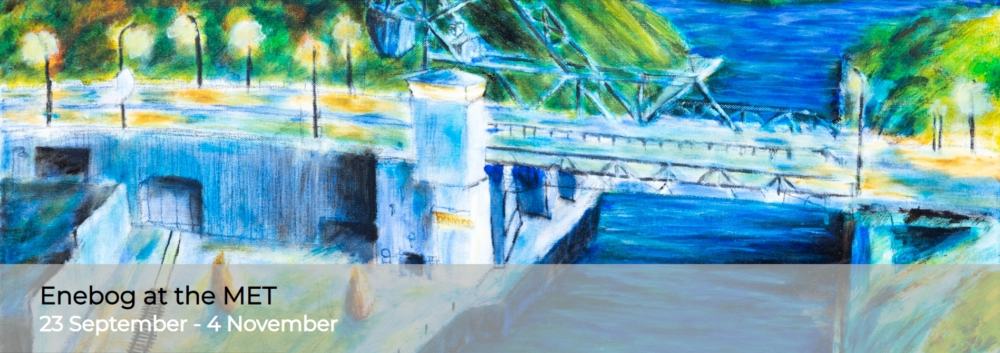

### The Works-section
  + The Works-section displays three galleries with nine art pieces each displayed in a 3x3 grid.
  + The images of the art-pieces zooms to a larger size when hovered (see the zoomed image of the braided flask below).
  + The user can click an art-piece if he want to see a larger display of it.
  + Currently the display page of only one art pieces has been implemented which is the first image (braided flask).

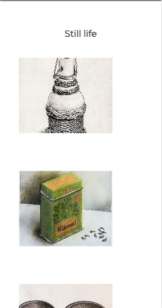
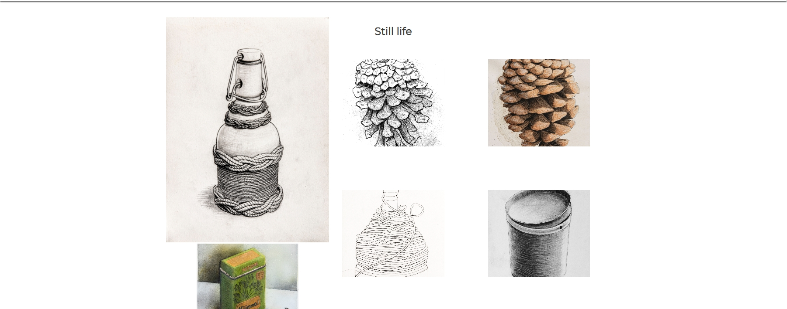

### The full-size display-page
  + When an art piece is clicked in the Works-section the user is taken to a separate display page (unique for each art piece) where the art is annotated and display in a larger size.

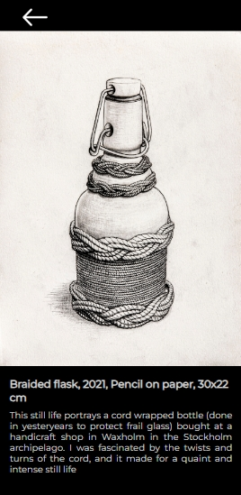
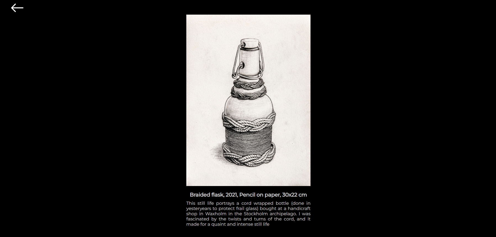

### The ABOUT-section
  + This section features a photo of the artist together with a short bio explaining his process, favorite motives and mediums and his reasons for drawing and painting.

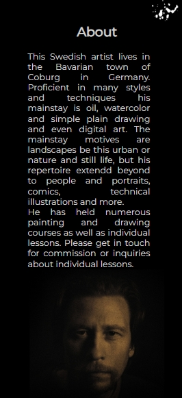
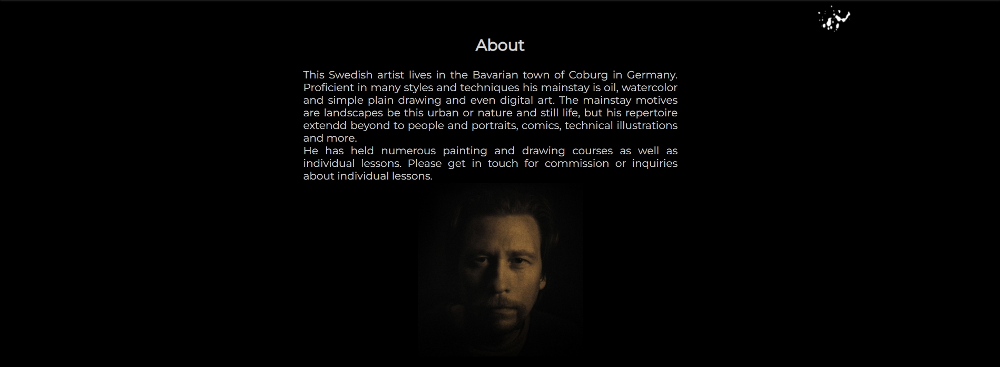

### The Contact-section with form
  + The contact section provides postal address, email and telephone number to the artist. All fields (except subject) are reqiered to be filled in and filled in correctly before the message is allowed to be submitted.
  + The contact section also provide a form which the user can use as a way of reaching out to the artist directly.
  + The bright orange submit-button acts here as a "call-to-action" button, the action being to reach out to the artist.

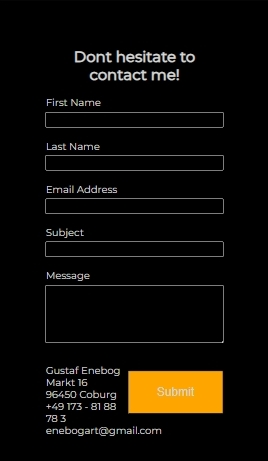

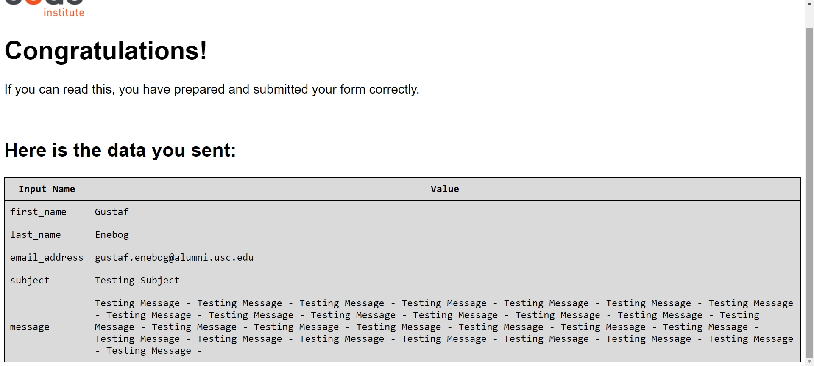

### The Footer
+ The footer contain icons linking to all the places the artist can be found in social media including a link to the London based online gallery, Artfinder, where Enebog’s art can be acquired.

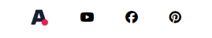

+ Features remaining to be implemented
  + Make carousel/slide show of the Hero-image on the top of the page.
  + Add display pages for all art works in the Work-section.
  + Make carousel/slide show of the display pages as to be able to show close-ups of details and "the making of"-pictures.
  + Responsive design on the art display page to make the image (with annotation) perfectly filling the screen without distorting or overflowing.
  + Possibly replacing the display-pages with a display directly in the Work-section using a modal screen.
  + Returning from the display page to the main page should place the user exactly on the art piece in the work-section **where he originaly came** from instead of, as it is now, to the **top** of the main page.
  + Original idea for a more irregular gallery wall.

## Design
+ Since the users can be expected to often be older and less IT savvy the website needs to be very simple and intuitive and should remain so even if more content is being added. The solution to this is a single page website with a header where the logo and navbar is always visible. As this is an artist website showing of Art, the Surface Plane with its graphics is arguably more important than the sites functional features (providing they all work, that is) since this is to work in concert with, and enhance the content. The minimalistic, uncluttered, and sober graphics of the site are not only modern and user friendly for less it-savvy artist lovers but it does also provide the perfect setting for displaying art much like the simple white walls in a real art gallery.

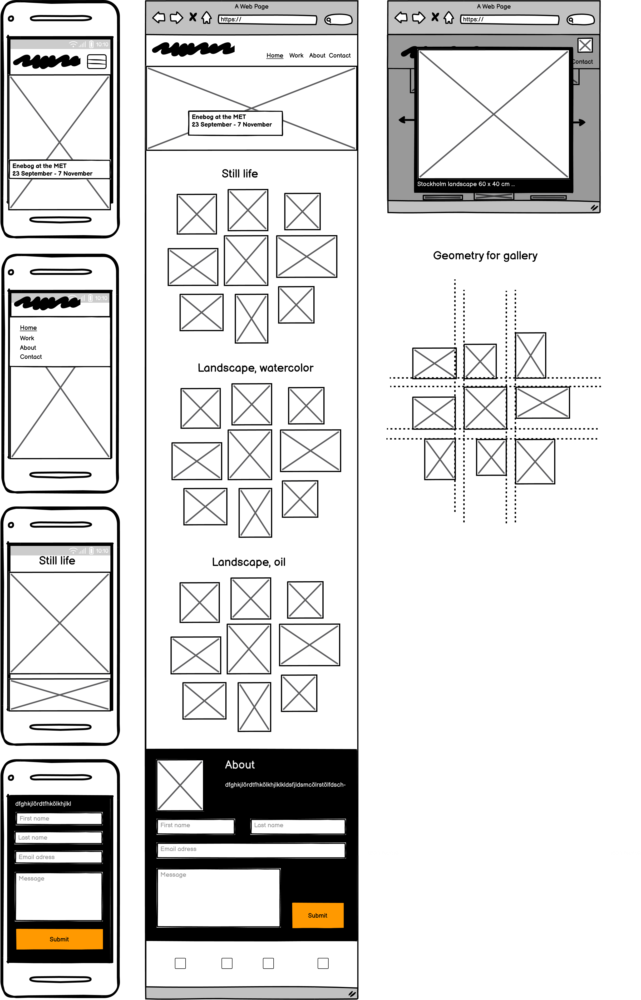

### Colors
+ The Black and White color theme provides a color-neutral background that does not interfere with the color theme of the actual art. It also has the secondary benefit of not distracting or drawing attention away from the art. 
+ One accent color, orange, has been used (away from the vicinity of the gallery section) on a “call to action”-button, again, the effect of the accent color becomes more efficient with the otherwise neutral color scheme.
+ Art is classically displayed on an either white or black background. This site does it both: white in the work-section and black on the display-page.
+ The black background on the last two sections (“About” and “Contact”) sets these two sections apart from the rest of the site and allow the footer to “return” to a white without any dividing line.
+ Font color on the black background sections (“About” and “Contact”) is set to a light grey rather than white for a slightly softer experience.

### Typography
A font-matching-tool has been used to test combinations of "header-fonts" and "paragraph-fonts" however its advice was ultimately discarded for a "gut-feel" to pick the single font "Open Sans Regular 400" with "Montserrat" as a fallback font and sans-serif as the fallback to that.

## Technologies Used
+ HTML5
+ CSS3
+ [Google Fonts:](https://fonts.google.com/) To import font family "Open Sans Regular 400", "Montserrat" into the style.css file which is used on all pages.
+ [Font Awesome:](https://fontawesome.com/) used in footer section to social icons and "hamburger"-icon in navbar for smaller devices.
+ [Balsamiq:](https://balsamiq.com/) Super nice program for creating wireframe drafts of the website.
+ [Fontpair:](Fontpair.co) was used to test combinations of fonts.
+ [Krita:](https://krita.org/en/) Used for creating, editing and re-sizing images (bitmap art).
+ [Clip Studio Paint:](https://www.clipstudio.net/en/) Used for creating and editing vectorgraphics-art such as the Enebog-logo.
+ [Am I Responsive:](http://ami.responsivedesign.is) Checking the responsiveness and generating the image in the beginning of this document showing my website on different devices/screensizes.
+ [GitPod](https://www.gitpod.io/) GitPod has been used as a cloud based IDE from which code was commited and pushed to GitHub.
+ [GitHub:](https://github.com/) GitHub is used to store the code that has been pushed from GitPod.

## Testing
### Manual testing
+ I have manually tested that:
	+ the links work and land you on the correct page or correct section within the page.
	+ a wrong input, e.g. email address field without an @-sign receive a complaint as well as a form submission-button-click results in a confirmation page.
  + the links in the header works correctly.
  + the navigation links work and the user is directed to the correct sections of the page.
  + the navigation links change text colour when hovering over.
  + the external link in the about section opens in a new tab and that the address is correct.
  + name, email and message is required to submit the form in the contact section.
  + the email input field must contain @ symbol to submit the form in the contact section.
  + the form submit button change text colour when hovering over.
  + “zoom on hover” work in gallery-section.
+ Manual testing has been carried out on:
  + Different browsers: Chrome and Firefox (Safari as not been tested) where a a bug in the form element was appearing in Firefox.
  + Responsiveness using different standard screen sizes testing the responsive design.

### Validator Testing
+ All code was tested for syntactical errors with perfect results using official validators:
  + HTML using the using W3C-the official validator for html-code (https://validator.w3.org/)
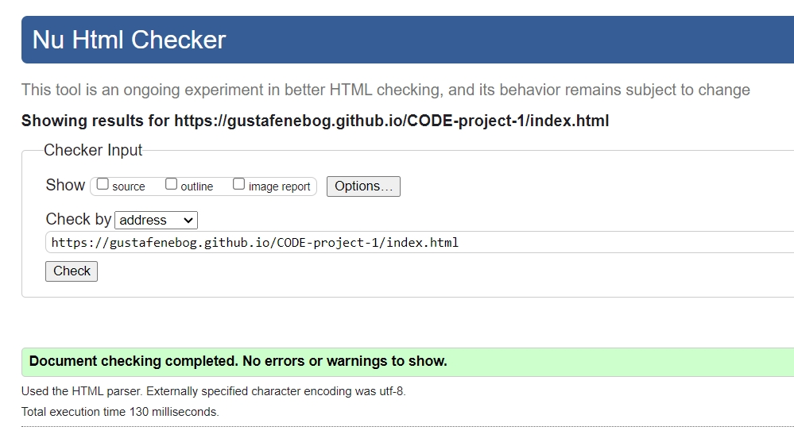
  + CSS using Jigsaw-the official validator for CSS-code (https://jigsaw.w3.org/css-validator/)
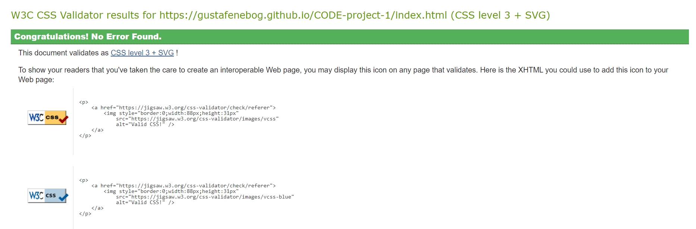
  + performance, accessibility, SEO etc. using Lighthouse in Chrome developer tools.
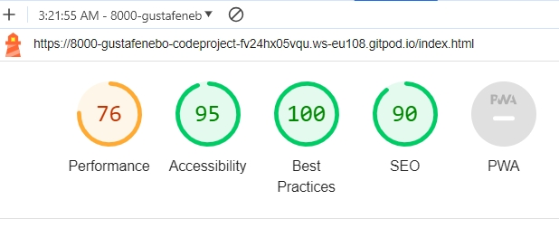
  + The reason why the Accesibility score is not perfect is because Lighthouse comes down on our continuous design-choise of a light grey (instead of a pure white) font colour on a black background, thus not reaching optimal contrast.
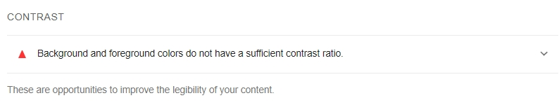
+ The code was also beautified using GitPods built in beautifyer.

### Bugs
+ Fixed bugs:
  + Change in logo and header height would not come through due to conflicting css-rules.
  + Page overflowed horizontaly (slider appeared).
  + "Underline on hover" in large display navbar disapeared due to a typo.
  + Hamburge-icon could not be vertically centered.
  + One-page-scroll-navigation stopped to far down in the work-, about- and contact-sections.
+ Remaining bugs:
  + The form flows down into the footer (or vice versa) in Firefox.
  + The "click-anywhere-on-page"-link on the display page has stopped working in the last versions.
  + An hour before submission the artist portrait was no longer horisontaly centered.

### Deployment
+ Go to your GitHub repo and choose the **settings** tab and then **Pages** on the left-hand sidebar and then make sure that the following is set as below:
  + **Sources** is set to ‘Deploy from Branch’
  + **Main** branch is selected
  + **Folder** is set to / (root)
+ Click save and go back to the **Code** tab and wait a few minutes for the build to finish. Make sure that you do not push to the repo during this time since this will cause the rebuild to fail.
+ Go to the **github-pages** under the **Deployment** section, further down on the right hand side.
+ Now you can see the URL to your deployed site under **Active deployments**. Click on the URL to go to your site. The URL will follow the following format: your-username.github.io/your project name/
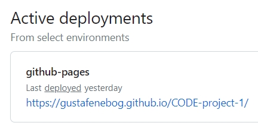

## Credits

### Readme
+ Inspiration for this readme-file has been taken from the readme-files of:
  + Code Institute "Coding Club"
  + Code Institues "Love Running"
  + My Bonsai Page by mittnamnkenny

### Code
+ The code for the header with navbar, form and footer from Code Institute's "Love Running" was used as a starting point for my code.
+ Code that is supposed to making the whole page clickable (not just back arrow) is taken from a forum however I am sorry to say that I have not been able to retrieve the source back to give credit.
+ "Zoom on Hoover" code snippet from 3W Schools (https://www.w3schools.com/howto/howto_css_zoom_hover.asp) has been used and modified to make images in the galleries in the work-section zoom when they are being hovered.

### Earlier implementation
+ The Features and Design sections has been based on Jesse James Garretts five pillars of webdesign.
+ Enebog art has already been implemented in a Squarespace-template-version. This new version has a changed design and it improves on weak points of this first version:
  + The all-important art was not displayed directly upfront but one or two clicks away.
  + Even after one click all of the art was not displayed in one single grid but required the user to step through each gallery one picture at a time.
  + The about and contact sections was separated albeit they fitted well together.

### Acknowledgement
A special thanks to my mentor at Code Institute for his nie ways and for most helpful input!

